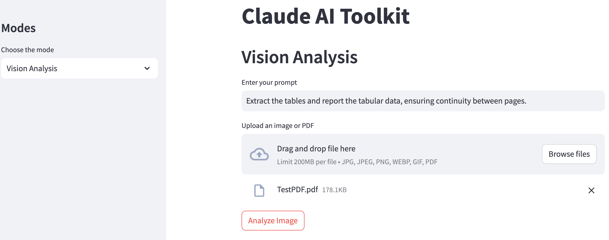
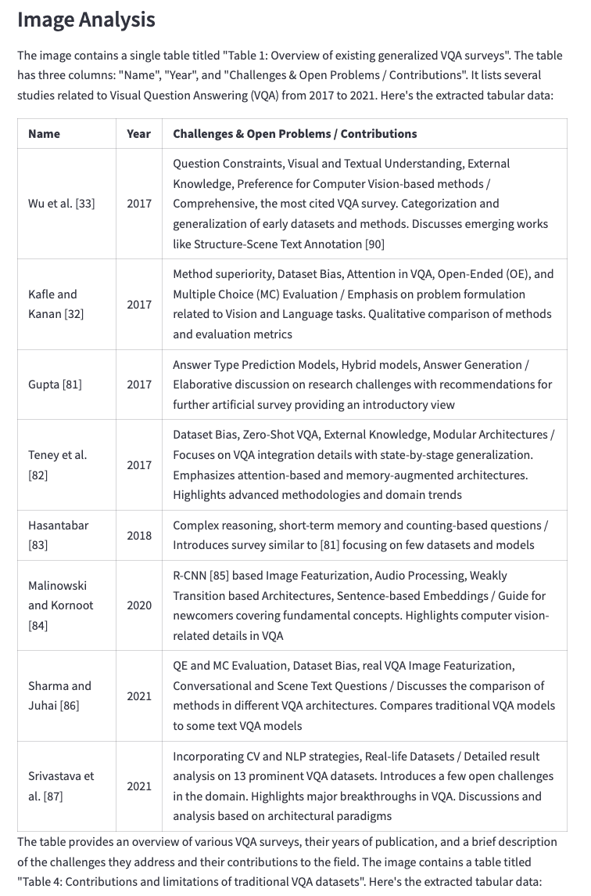
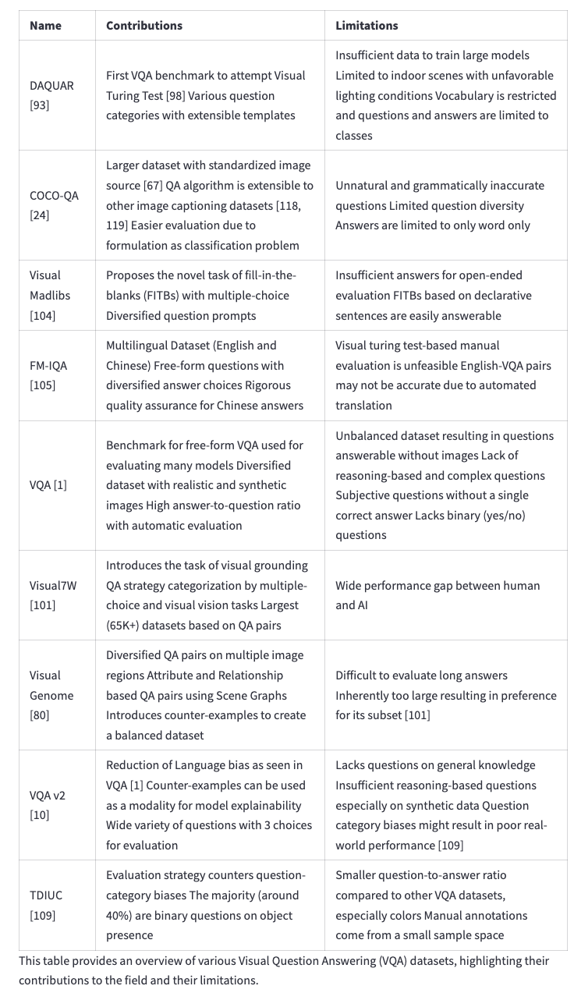

# Visual Question Answering (VQA) using Claude

<p align="center">
    <a href="https://claude.ai/" title="Go to claude.ai">
        
    </a>
</p>


<p align="center">
    <a href="/">
        <picture>
          <source media="(prefers-color-scheme: dark)" srcset="https://raw.githubusercontent.com/RMNCLDYO/claude-ai-toolkit/main/.github/anthropic-logo-dark.png">
          <source media="(prefers-color-scheme: light)" srcset="https://raw.githubusercontent.com/RMNCLDYO/claude-ai-toolkit/main/.github/anthropic-logo-light.png">
          
        </picture>
    </a>
</p>

## Overview

VQA_Claude is an extension of the Claude AI Toolkit (see: https://github.com/RMNCLDYO/claude-ai-toolkit), offering advanced Visual Question Answering capabilities with multi-page PDF analysis using Claude 3.5 Sonnet at its backend, via a simple Streamlit app interface. The Claude AI toolkit itself is designed to be user-friendly and highly adaptable, making it suitable for both beginners and advanced users. With the integration of the Streamlit app, users can easily interact with the Anthropic's models for text generation and vision analysis.

## Key Features
- **Streamlit App**: User-friendly interface for interacting with the toolkit.
- **Conversational AI**: Create interactive, real-time chat experiences (chatbots) or AI assistants.
- **Image Captioning**: Generate detailed descriptions and insights or create captions from images.
- **Text Generation**: Produce coherent and contextually relevant text and answers from simple prompts.
- **PDF Analysis**: Analyze multi-page PDFs using Visual Question Answering techniques.
- **Highly Customizable**: Tailor settings like streaming output, system prompts, sampling temperature and more to suit your specific requirements.
- **Lightweight Integration**: Efficiently designed with minimal dependencies, requiring only the `requests` package for core functionality.

## Prerequisites
- `Python 3.x`
- An API key from Anthropic

## Dependencies
The following Python packages are required:
- `requests`: For making HTTP requests to the Claude API.
- `python-dotenv`: For managing API keys and other environment variables.
- `streamlit`: For the web interface.
- `PyMuPDF (fitz)`: For PDF processing.

## Installation
To use VQA_Claude, clone the repository to your local machine and install the required Python packages.

Here's the formatted content to match a README file for a Git repository:

# VQA_Claude

## Clone the Repository

```bash
git clone https://github.com/menonpg/VQA_Claude.git
```

## Navigate to the Repository Folder

```bash
cd VQA_Claude
```

## Install the Required Dependencies

```bash
pip install -r requirements.txt
```

## Configuration

Obtain an API key from Anthropic.

You have three options for managing your API key:

<details>
<summary>Click here to view the API key configuration options</summary>

### Setting it as an Environment Variable on Your Device (Recommended for Everyday Use)

1. Navigate to your terminal.
2. Add your API key like so:

    ```bash
    export CLAUDE_API_KEY=your_api_key
    ```

This method allows the API key to be loaded automatically when using the wrapper or CLI.

### Using an .env File (Recommended for Development)

1. Install `python-dotenv` if you haven't already:

    ```bash
    pip install python-dotenv
    ```

2. Create a `.env` file in the project's root directory.
3. Add your API key to the `.env` file like so:

    ```bash
    CLAUDE_API_KEY=your_api_key
    ```

This method allows the API key to be loaded automatically when using the wrapper or CLI, assuming you have `python-dotenv` installed and set up correctly.

### Direct Input

If you prefer not to use a `.env` file, you can directly pass your API key as an argument to the CLI or the wrapper functions.

**CLI**

```bash
--api_key "your_api_key"
```

**Wrapper**

```python
api_key="your_api_key"
```

This method requires manually inputting your API key each time you initiate an API call, ensuring flexibility for different deployment environments.

</details>

## Usage

### Streamlit App

The Streamlit app provides a user-friendly interface for both text generation and vision analysis.

#### Launching the App

To start the Streamlit app, run:

```bash
streamlit run app.py
```


## Examples

Below are some examples from the `samples/` folder of the repository. The outputs are based on the prompt asked in the `streamlitUI.png` on the following PDF: `samples/TestPDF.pdf`.

### Streamlit UI



### Output Part 1



### Output Part 2

